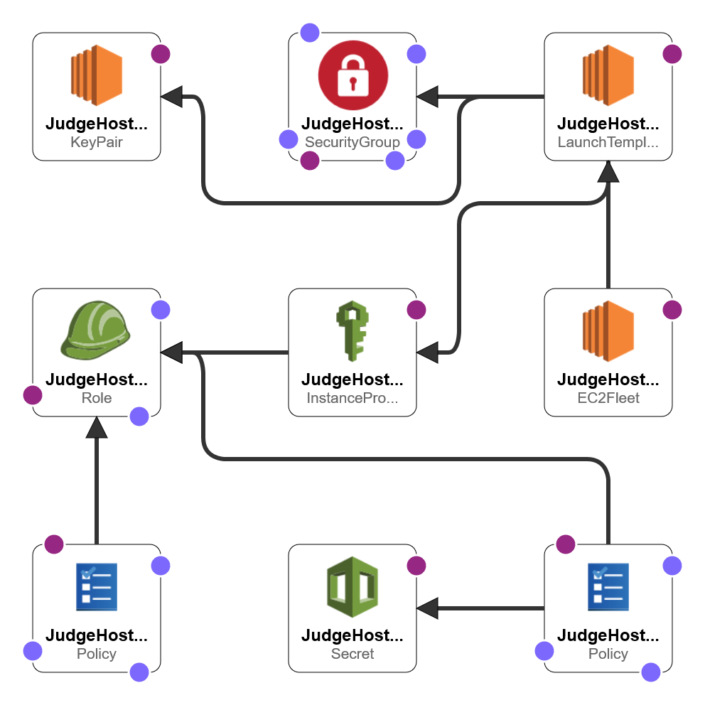

# DOMjudge judgehosts on AWS using Docker

This repository offers an easy way to deploy DOMjudge judgehosts using CloudFormation on AWS.

## Requirements
- aws-cli/1.25.60 Python/3.8.10 botocore/1.27.59
    - [Login](https://docs.aws.amazon.com/cli/latest/userguide/cli-configure-quickstart.html) to able to use the CLI. 
    - The default region used is `eu-central-1`, if you wish to use a different region see [Configure Deployment](#configure-deployment).
    - The reason we use `aws-cli v1` is to be able to use a virtual-env, `v2` should work as well but might require some modifications.
- [jq](https://manpages.ubuntu.com/manpages/xenial/man1/jq.1.html)


## Template
The [judge-host.yaml](cloud-formation/judge-hosts.yaml) template will create all the necessary resources for the judgehosts and deploy an EC2Fleet of judgehost VMs.



What is created?
- `SecretsManager::Secret`: secret for the judgehost password
- `S3::Bucket`: contents of [./judgehosts](./judgehost/) which contains all the required code to setup and deploy the judgehosts
- `IAM::InstanceProfile`: profile to attach the role the judgehost VMs
    - `AWS::IAM::Role`: role for the judgehosts in order to access the `secret` and `S3 bucket`
        - `IAM::Policy`: policies to access the `secret` and the `S3 bucket`
- Resources to ssh to the judgehost VMs
    - `EC2::SecurityGroup`: Ingress port 22 (ssh)
    - `EC2::KeyPair`: ssh private key, can be found in `Parameter Store`
- `EC2::EC2Fleet`: EC2 fleet of the judgehost VMs
    - `EC2::LaunchTemplate`: template for EC2 judgehost instance deployment

## IAM Permission:
TODO:

## Configure Deployment
1. Modify the `DOM_BASEURL` in [.env](./judgehost/.env) to the base url of your domserver.
2. (Optional) Modify the `Template variables` in the [deploy_judgehosts.sh](./cloud-formation/deploy_judgehosts.sh) script to the names you wish. You can leave the default but make sure there are no conflicts in the names with already existing resources.
    - Apply the modifications also to the [judge-hosts.yaml](./cloud-formation/judge-hosts.yaml) for the `s3_bucket_name` variable in the `UserData` field of `JudgeHostLaunchTemplate`. 
    - Apply the modifications also to the [docker_start.sh](./judgehost/scripts/docker_start.sh) script for the `s3_bucket_name`, `secret_name` and `region` variables.
    - You will find `TODO:` notes in these files to guide you.


The deployment has been tested with Debian. To retrieve the `AMI` for a specific region of the latest official [Debian 11 Bullseye](https://wiki.debian.org/Cloud/AmazonEC2Image/Bullseye) run:

```bash
aws ec2 describe-images --owners '136693071363' \
    --filters 'Name=name,Values=debian-11-*' \
            'Name=state,Values=available' \
            'Name=architecture,Values=x86_64' \
            'Name=virtualization-type,Values=hvm' \
            'Name=root-device-type,Values=ebs' \
            'Name=image-type,Values=machine' \
    --query 'sort_by(Images, &CreationDate)[-1].[ImageId]' \
    --output 'text' \
    --region {region}
```

## Deployment
Deploying the judgehost stack is as easy as running:
```bash
chmod +x ./cloud-formation/deploy_judgehosts.sh
./cloud-formation/deploy_judgehosts.sh
```
The script will prompt you to validate the new CloudFormation stack to be created. And, will output the judgehost password generated that you will need to update on your domserver (`/jury/users/`). Creating the stack might take several minutes, the script should give you the creation status of the stack every 30 seconds.

If you wish to understand what the script is doing, or wish to debug, read [README_manual](./README_manual.md) for instructions on how to do a manual deployment.

When the script has ended, you have successfully created all resources with 0 judgehosts. **Update the judgehost user password on your domserver, or update the secret itself in the `AWS::SecretsManager` with an already existing one** 

Once the judgehost secret has been set on your domserver, you can modify (TotalCapacity, OnDemandCapacity) and run the bellow command to increase the number of judgehosts to N `On Demand` VMs. **It is advised not to use `Spot instances`. As if they get claimed while a judgehost is running a task, DOMjudge will have a hard time recovering**.
```bash
aws cloudformation update-stack --stack-name {stack_name} \
                            --use-previous-template \
                            --parameters ParameterKey=OnDemandCapacity,ParameterValue={N} \
                                        ParameterKey=TotalCapacity,ParameterValue={N} \
                            --capabilities CAPABILITY_NAMED_IAM 
```

The judgehost(s) should be available to your domserver interface within 5-10 minutes. As they need to install docker, other required packages, download the [judgehost image](https://hub.docker.com/r/domjudge/judgehost/) and deploy. The *judgehost ID* is the `EC2 Instance ID` of the specific EC2 VM.

You can play with the template parameters to change the number of instances. **You do not need to change the template directly**, just specify the `--parameters` flag like in the previous command. Or, do it using the AWS console in `CloudFormation`. 


## Starting/Stopping or Scaling-Down judgehost VMs
Upon creation of the judgehost VM, the [docker_init.sh](./judgehost/scripts/docker_init.sh) script is executed in the VM. It installs all required resources, and, adds the [docker_start.sh](./judgehost/scripts/docker_start.sh) script to the startup of the VM using `crontab`. 

The [docker_start.sh](./judgehost/scripts/docker_start.sh) synchronizes the `judgehost password` and the `source code`. Therefore, if the any of the previously mentioned are modified/updated. Rebooting the judgehost VMs will suffice to apply any fixes and reconnect to the server without requiring any additional action. 

If you terminate manually a specific judgehost VM, a new VM will be automatically provisioned by the CloudFormation stack. If you wish to scale down the number of judgehosts. Either *safely* stop the specific VM if you plan on using it again and don't mind the cost of a stopped instance. Or, decrease the number of judges on the CloudFormation template. 

Keep in mind that:
- If you power-off/reboot a judgehost VM, all internal judging related data will be lost (see comments of [docker_start.sh](./judgehost/scripts/docker_start.sh))
- When downsizing, there is no rule as to which VM will be claimed. Therefore, a working judgehost could be claimed. AWS seems to prioritize termination of powered-off instances when downsizing, but this is not formally stated.

##  Setting up ssh
Once you have deployed your judgehosts, you can fetch your ssh key in the AWS console in the `AWS Systems Manager/Parameter Store` (Change the permission of the key, `600` or `400`). A wildcard ssh `.config` you can use to connect to your judgehosts is:
```ssh-config
Host ec2-*
    User admin
    Hostname %h.eu-central-1.compute.amazonaws.com
    IdentityFile ~/.ssh/judgehost_key.pem
```
And connect using the target instance's `public IPv4 DNS`:
```bash
$ ssh ec2-X-X-X-X
```

## Something went wrong
- If the deployment crashes investigate what went wrong in the CloudFormation logs. 
- If the CloudFormation stack get deployed, but the judgehosts never connect to the domserver. Something went wrong in the initialization scripts. Connect to the judgehost VM and check the user data log files:
    - `/var/log/cloud-init.log` 
    - `/var/log/cloud-init-output.log`

## Cleanup 
If you wish to cleanup after a crash, or terminate the judges. The following commands will clean all resources:

- Delete the CloudFormation stack and all resources will be freed. The `stack_name` is the variable in the [deploy_judgehosts.sh](./cloud-formation/deploy_judgehosts.sh) script.
- Delete the previously created bucket. The `s3_bucket_name` and `region` are the variables in the [deploy_judgehosts.sh](./cloud-formation/deploy_judgehosts.sh) script. 

```bash
aws cloudformation delete-stack --stack-name {stack_name}
aws s3 rb s3://{s3_bucket_name}/ --region {region} --force
```
